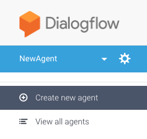

# Starter-Kit Rainbow SDK for Node.JS with Dialogflow

Welcome to the Alcatel-Lucent Enterprise **Starter-Kit Rainbow SDK for Node.JS with Dialogflow**!

The Alcatel-Lucent Enterprise (ALE) Starter-Kit Rainbow SDK for Node.JS Dialogflow is a basic sample for starting your development using the SDK for Node.JS and Dialogflow in an easy way and within an advanced environment.


## Preamble

You need a Node.JS LTS release installed on your computer.

You need a Rainbow account. Connect to the [Rainbow HUB](https://hub.openrainbow.com) to get your developer account.


## Installation

Clone this repository in the directory you want and then open a shell and executes the following command

```bash

$ npm install

```

## Content

This Starter-Kit is a Node.JS application that:

- Starts the SDK for Node.JS, connects it to Rainbow and answers to incoming chat messages by using Dialogflow to understand natural language

- Starts a web server for monitoring your application

Note: You have to teach Dialogflow on the natural language you want that the bot understands. 


## Setup

In order to setup your application, you have to configure 3 JSON files:

- `app/config/bot.json`: This file contains the parameters for the SDK for Node.JS. Modify it with your Rainbow account.

- `app/config/router.json`: This file contains the default parameter for the embedded web server. Modify it according to your needs.

- `app/modules/dialogflow.js`: This file contains the dialogflow login. Adapt it depending on your needs.

Once you have configured these two files, you can start the application by launching the following command:

```bash

$ node index.js

```

### Set up a Dialog flow agent

Go to 

Create a new agent by clicking on **Create a new agent**:



Enter a name and click on **Create**.

Click on the gear in order to access to the agent **settings**, go to the Google project space and click on **Service Account** email, you will be redirected to the **IAM** dashboard.

Please follow the tutorial [How to Setup DialogFlow V2 Authentication Programmatically with node.js](https://medium.com/@tzahi/how-to-setup-dialogflow-v2-authentication-programmatically-with-node-js-b37fa4815d89) in order to retrieve your project authentication json file to be associated to the environment variable **GOOGLE_APPLICATION_CREDENTIALS**


## Server API

Your Node.JS contains an embedded server with 3 default routes:

- `GET .../health/ping`: API for having an health check of your application

- `POST .../health/sdk/restart`: API for restarting the SDK for Node.JS (stop and start).

- `GET .../health/sdk/status`: API for having a status of the SDK for Node.JS

You can test these routes using CURL. Here is an example of testing the `health/ping` route when the Web Server is launched using `HTTP` and port `3002`:

```bash

$ curl -X GET http://localhost:3002/health/ping
> {"code":0}

```

Note: When testing in HTTPS, default self-signed certificates are proposed. For testing with CURL, you have to add the parameter `-k` to avoid the CURL's verification like as follows (launched with `HTTPS` and port `3003`):

```bash
$ curl -X GET https://localhost:3003/health/ping -k
> {"code":0}

```


## Environment

### ESLint

Basic rules for Node.JS JavaScript development have been added.

### Unit Tests

Tests have to be added in directory `test`.

to launch the test, open a shell and execute the following command:

```bash

$ npm test

```

Each time a file is modified, the tests are executed.

If you want to check the code coverage, launch the following command:

```bash

$ npm run coverage

```

### Modules

New modules can be added to your application in directory `app`.

## Docker container usage

Thanks to Dockerfile available a root directory, you are able to run the current Starter Kit into Docker.

After Docker installation ( See [Docker](https://www.docker.com/community-edition) ), run the following command to build your own image.

```
docker build -t rainbow-api-hub/startkit-sdk-nodejs .
```

3 environment variables are required to run a container instance with the previous builded image:

- `RAINBOW_BOT_LOGIN` (_mandatory_): User email associated to your bot.

- `RAINBOW_BOT_PASSWORD` (_mandatory_): User password associated to your bot.

- `RAINBOW_BOT_APPID` (_mandatory_): Application ID associated to your bot.

- `RAINBOW_BOT_APPSECRET` (_mandatory_): Application Secret associated to your bot.

- `RAINBOW_HOST` (_optional_, default value: sandbox.openrainbow.com ): Target host where your want to  run your bot.

- `GOOGLE_APPLICATION_CREDENTIALS` (_mandatory_): relative path of the google authentication json file, file must be placed into the current project  directory or in a subdirectory in order to be accessible from the docker container. 


Use the following command in order to start you container instance, with the port 8888 as REST api entry point port

```
docker run -p 8888:8080 -e RAINBOW_BOT_LOGIN=<BOT_EMAIL> -e RAINBOW_BOT_PASSWORD=<BOT_PWD> ... -t rainbow-api-hub/startkit-sdk-nodejs
```

## Cloudfoundry support

Thank you the manifest.yml file, you are able to deploy the project into cloudfoundry infrastructure like IBM Bluemix.